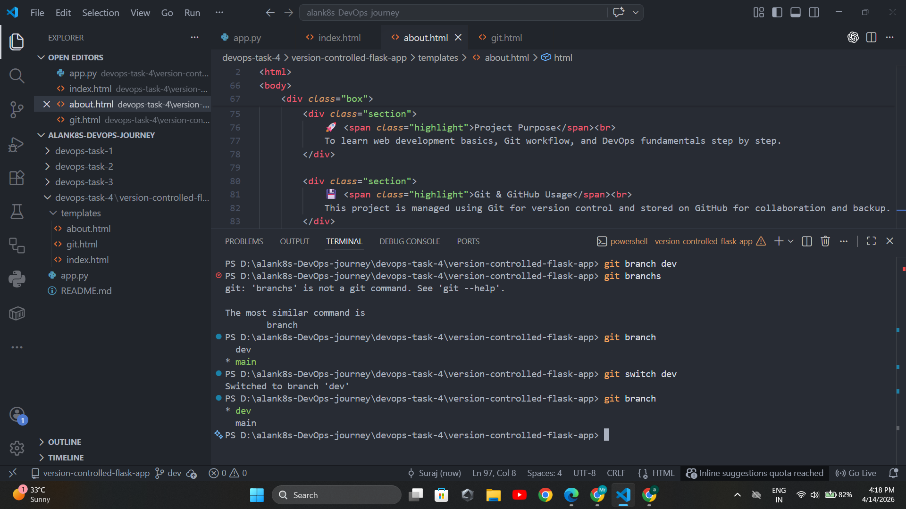
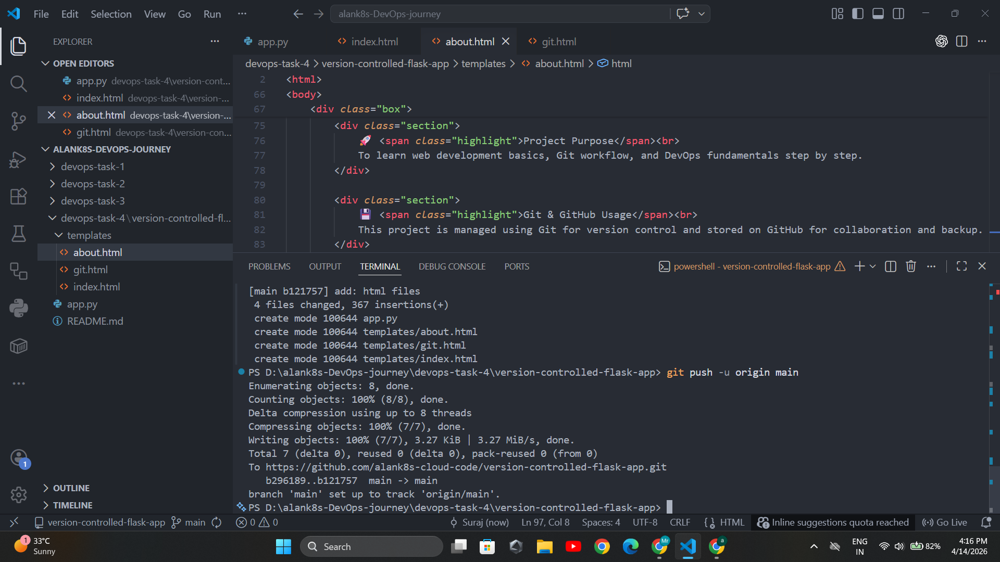
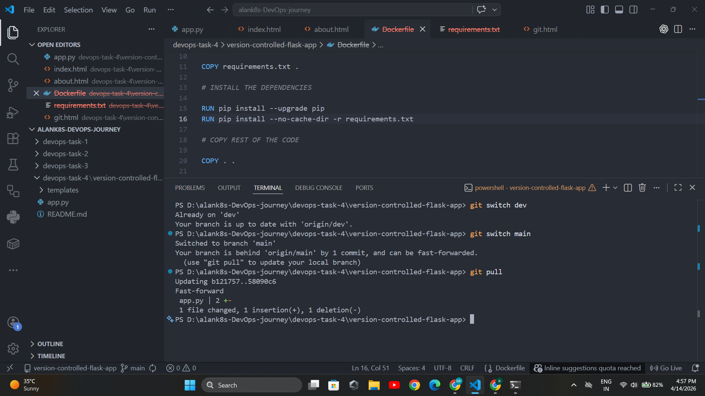
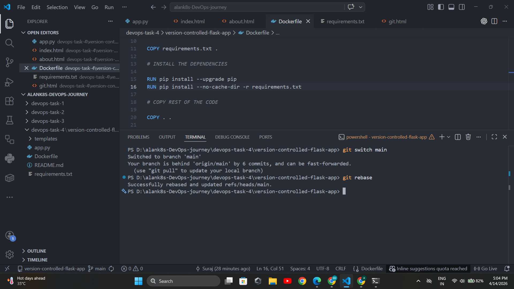
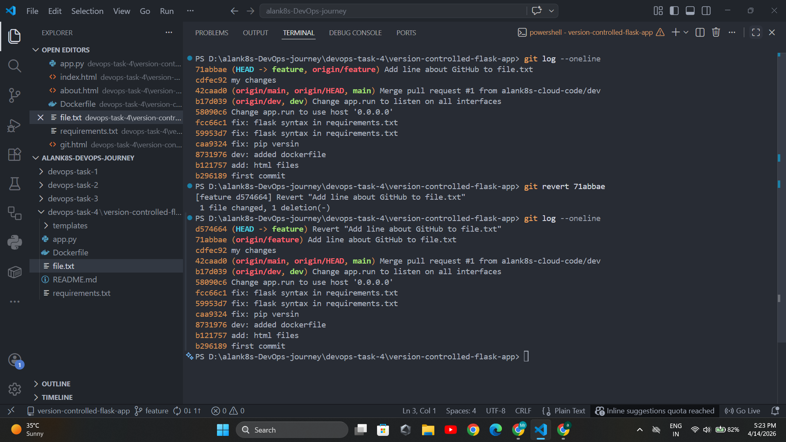
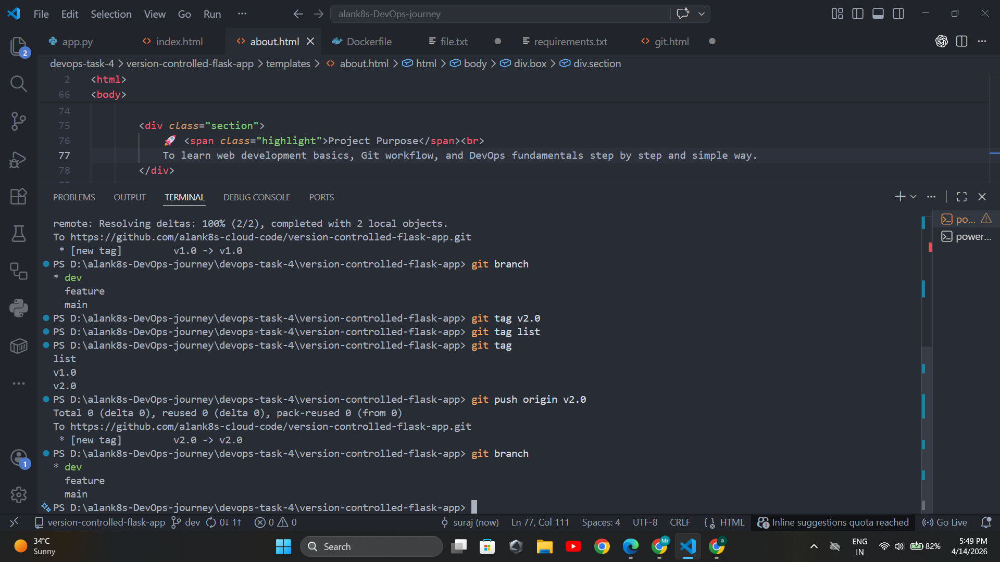
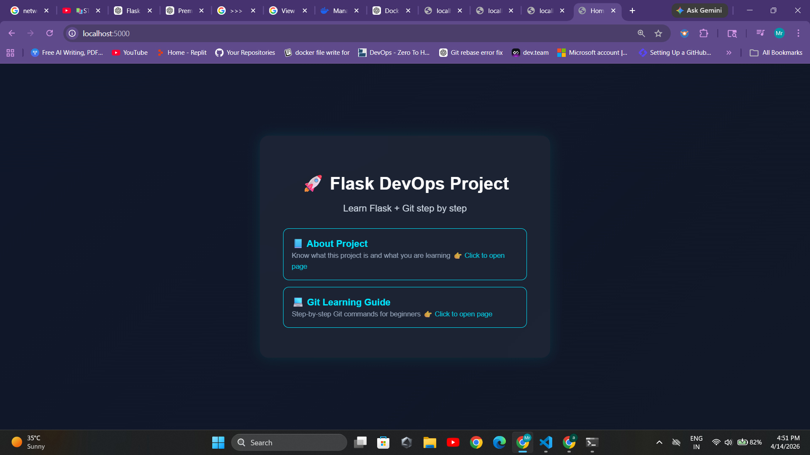
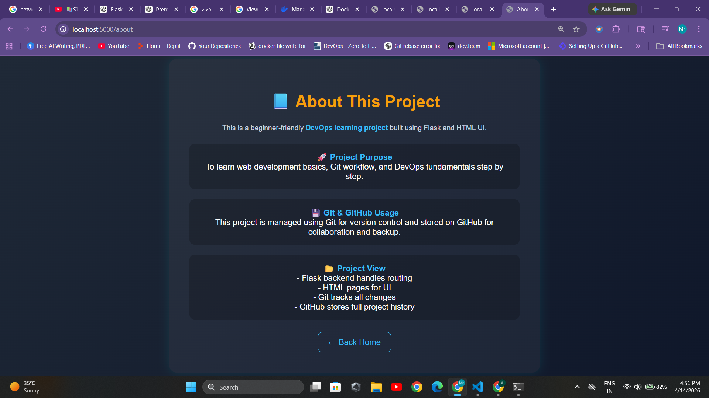
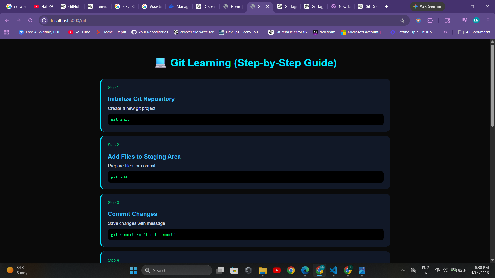

# 📘 Build a Version-Controlled DevOps Project with Git

## 🚀 What is Git?

Git is a **Distributed Version Control System (DVCS)** used to track changes in source code during software development. It allows multiple developers to work together efficiently.

### 🔥 Key Features of Git:

* Tracks code changes
* Maintains history of project
* Allows branching and merging
* Works offline (distributed system)

---

## 🌐 What is GitHub?

GitHub is a **cloud-based platform** used to host Git repositories.

### 🔥 Key Features of GitHub:

* Stores Git repositories online
* Collaboration with teams
* Pull requests & code reviews
* CI/CD integration

👉 Git = Tool (local)
👉 GitHub = Platform (remote)

---

## 📂 Project Structure 

```

version-controlled-flask-app/
│── app.py              # Main Flask application file
│── Dockerfile          # Used to containerize the application using Docker
│── requirements.txt    # Contains all Python dependencies
│── README.md           # Project documentation and setup guide
│── .gitignore          # Specifies files/folders to ignore in Git
│── git.html            # Page showing Git learning/output results
│
├── templates/          # HTML templates for the web app
│   ├── index.html      # Home page
│   ├── about.html      # About page
|   ├── git.html        # Git learning/output page
│
├── asset/              # Stores Git task outputs (screenshots)
│   ├── branch.png      # Git branching workflow
│   ├── log.png         # Git commit history log
│   ├── pro-1.png       # Project output screenshot 1
│   ├── pro-2.png       # Project output screenshot 2
│   ├── pro-3.png       # Project output screenshot 3
│   ├── pull.png        # Git pull operation
│   ├── push.png        # Git push operation
│   ├── rebase.png      # Git rebase demonstration
│   ├── tag1.png        # Git tagging example


```

---

## 🧠 Basic Git Workflow

1. Initialize repository
2. Add files to staging area
3. Commit changes
4. Push to GitHub
5. Pull updates from GitHub

---

## ⚙️ All Basic Git Commands

### 🔹 Setup Git

```bash
git --version
git config --global user.name "Your Name"
git config --global user.email "you@example.com"
```

---

### 🔹 Create Repository

```bash
git init
```

---

### 🔹 Check Status

```bash
git status
```

---

### 🔹 Add Files to Staging

```bash
git add .
git add filename.txt
```

---

### 🔹 Commit Changes

```bash
git commit -m "commit message"
```

---

### 🔹 View History

```bash
git log
git log --oneline
git log --graph --oneline
```

---

### 🔹 Branching

```bash
git branch dev
git checkout -b dev
git branch feature
git switch feature
```

---

### 🔹 Merging

```bash
git merge dev
```

---

### 🔹 Remote Repository (GitHub)

```bash
git remote add origin <repo-url>
git remote -v
git push -u origin main
git push origin main
git pull origin main
```

---

### 🔹 Clone Repository

```bash
git clone <repo-url>
```

---

### 🔹 Undo Changes

```bash
git restore filename.txt
git reset HEAD filename.txt
git revert <commit-id>
```

---

## 🔀 Branch Strategy (Recommended)

* `main` → Production code
* `dev` → Development branch
* `feature/*` → New features

---

## 🖼️ Task4: output

### 📌 Step 1: create branch and switch

```

```

### 📌 Step 2: After git add and git commit -m "what you add/change"

```md

```

### 📌 Step 3: My git head is behind when i use these commands

```md


```

### 📌 Step 4: git log : to show your commit history

```md


```

### 📌 Step 5: A Git tag is like a name you give to a saved version of your project so you can find it later easily.
```md


```

### 📌 Output: Version-Controlled DevOps Project with Git 
```md



```


---

## 💡 Key Learnings

* Git tracks code changes using commits
* GitHub stores repositories online
* Branching allows parallel development
* Merging combines work safely
* Pull requests help collaboration

---

## 🎯 Practice Task

1. Initialize repo
2. Create `dev` and `feature` branches
3. Make changes in each branch
4. Merge into `main`
5. Push to GitHub

---
### 📌 Result

Successfully learned Git basics, including tracking changes, using branches, and managing project versions efficiently.

